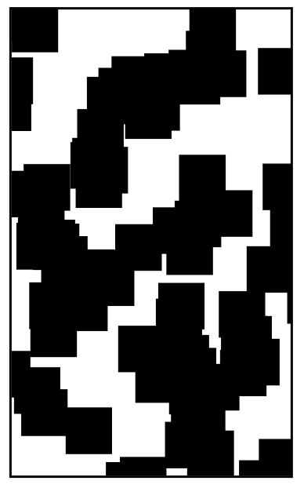

## 00: initial

## 01: draw canvas
- start @ 1:25:33 => [link](https://youtu.be/GFO_txvwK_c?t=85m33s)
- end @ 1:27:47 => [link](https://youtu.be/GFO_txvwK_c?t=87m47s)
- demo => [link](https://woodstockcs.github.io/enemy-patterns/milestone-01/)
- code => [link](https://github.com/woodstockcs/enemy-patterns/tree/main/milestone-01)

## 02: draw enemy
- start @ 1:27:47 => [link](https://youtu.be/GFO_txvwK_c?t=87m47s)
- end @ 1:30:26 => [link](https://youtu.be/GFO_txvwK_c?t=90m26s)
- demo => [link](https://woodstockcs.github.io/enemy-patterns/milestone-02/)
- code => [link](https://github.com/woodstockcs/enemy-patterns/tree/main/milestone-02)

## 03: animate enemy
- start @ 1:30:26 => [link](https://youtu.be/GFO_txvwK_c?t=90m26s)
- end @ 1:31:26 => [link](https://youtu.be/GFO_txvwK_c?t=91m26s)
- demo => [link](https://woodstockcs.github.io/enemy-patterns/milestone-03/)
- code => [link](https://github.com/woodstockcs/enemy-patterns/tree/main/milestone-03)

## 04: animate two enemies
- start @ 1:31:26 => [link](https://youtu.be/GFO_txvwK_c?t=91m26s)
- end @ 1:34:17 => [link](https://youtu.be/GFO_txvwK_c?t=94m17s)
- demo => [link](https://woodstockcs.github.io/enemy-patterns/milestone-04/)
- code => [link](https://github.com/woodstockcs/enemy-patterns/tree/main/milestone-04)

## 05: create enemy class
- start @ 1:34:17 => [link](https://youtu.be/GFO_txvwK_c?t=94m17s)
- end @ 1:36:10 => [link](https://youtu.be/GFO_txvwK_c?t=96m10s)
- demo => [link](https://woodstockcs.github.io/enemy-patterns/milestone-05/)
- code => [link](https://github.com/woodstockcs/enemy-patterns/tree/main/milestone-05)

## 06: animate 100 shapes
- start @ 1:36:10 => [link](https://youtu.be/GFO_txvwK_c?t=96m10s)
- end @ 1:40:50 => [link](https://youtu.be/GFO_txvwK_c?t=100m50s)
- demo => [link](https://woodstockcs.github.io/enemy-patterns/milestone-06/)
- code => [link](https://github.com/woodstockcs/enemy-patterns/tree/main/milestone-06)

## 07: show sprite
- start @ 1:40:50 => [link](https://youtu.be/GFO_txvwK_c?t=100m50s)
- end @ 1:46:07 => [link](https://youtu.be/GFO_txvwK_c?t=106m07s)
- demo => [link](https://woodstockcs.github.io/enemy-patterns/milestone-06/)
- code => [link](https://github.com/woodstockcs/enemy-patterns/tree/main/milestone-06)

## 08: animate sprite

